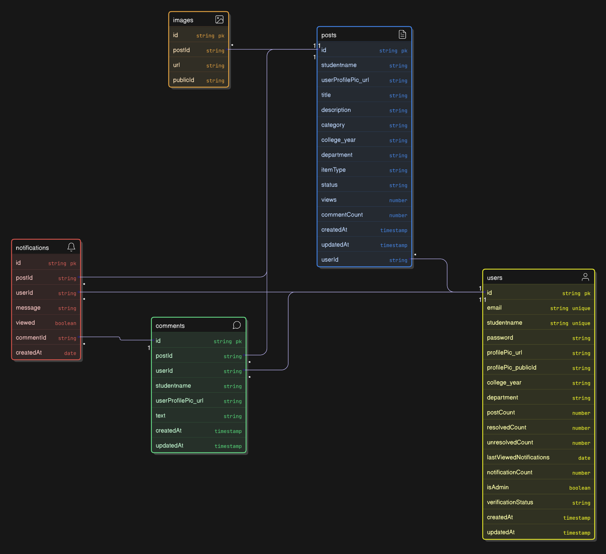

#  LostLink - Lost and Found Service

## 📘 Overview

**LostLink** is a full-stack web application designed to help students and campus communities easily **report, track, and recover lost or found items**.
Users can post items with images, comment for quick communication, and receive real-time notifications when someone interacts with their posts.

---

## ⚙️ Backend Implementation

The backend is built using **Node.js**, **Express**, and **MongoDB**, with a focus on **security**, **scalability**, and **clarity**.
It features RESTful APIs, **JWT authentication**, **role-based authorization**, and **Cloudinary** integration for image handling.
Admins have additional privileges to manage users, posts, and maintain a safe environment.

---

## 🧩 Technology Stack

* **Node.js** – Backend runtime
* **Express.js** – Server framework
* **MongoDB + Mongoose** – Database & schema modeling
* **JWT Authentication** – Secure user sessions
* **Cloudinary** – Image storage & optimization

---

## 🔐 Authentication & Authorization

* JSON Web Token (**JWT**) based authentication
* **Protected routes** with middleware verification
* **Role-based access control** (`Admin` / `User`)
* Tokens are sent as **Bearer tokens** in the Authorization header

> 🔸 In Postman, select **Authorization → Type: Bearer Token**, and paste your token there.

---

## 🧱 Database Models

* **User** – Stores profile details, post/comment counts, and profile picture info
* **Post** – Represents lost or found items, includes multiple images and metadata
* **Comment** – Linked to posts for communication between users
* **Notification** – Tracks new interactions (like comments) for each user
### ER Diagram


---

## 🖼️ Image Management

* **Cloudinary integration** for fast, secure image storage
* **Profile picture upload** and management
* **Multiple image upload** for posts (max 3)
* **Automatic image cleanup** when a post or user is deleted
* **File validation and optimization** for secure uploads
* **Size and format restrictions** enforced via `multer` middleware

---

## 🔔 Notification System

* **Automatic notifications** when a user comments on someone’s post
* **Unread notification count** tracked for each user
* **Auto-cleanup** of old notifications (3-day TTL)
* **Cascade deletion** of notifications when related posts/comments are removed
* **Last viewed timestamp** stored for accurate updates

---

## 🚀 API Routes

### 🔑 Auth Routes

| Method   | Endpoint             | Description                                             |
| -------- | -------------------- | ------------------------------------------------------- |
| **POST** | `/api/auth/register` | Register new user/admin (with optional profile picture) |
| **POST** | `/api/auth/login`    | Login as user or admin                                  |
| **POST** | `/api/auth/logout`   | Logout user/admin                                       |

> 🔹 Admin and user registration use the same endpoint.
> To make an admin, set `isAdmin = true` and `verifyStatus = "verified"` manually in the database.

---

### 👤 User Routes

| Method     | Endpoint              | Description           |
| ---------- | --------------------- | --------------------- |
| **GET**    | `/api/user/stats`     | Get user statistics   |
| **DELETE** | `/api/user/users/:id` | Delete a user profile |

---

### 🖼️ Upload Routes

| Method   | Endpoint              | Description                      |
| -------- | --------------------- | -------------------------------- |
| **POST** | `/api/upload/profile` | Upload a profile picture         |
| **POST** | `/api/upload/post`    | Upload up to 3 images for a post |

---

### 📦 Post Routes

| Method     | Endpoint             | Description                                          |
| ---------- | -------------------- | ---------------------------------------------------- |
| **GET**    | `/api/post`          | Get all posts (filtered based on login/admin status) |
| **POST**   | `/api/post`          | Create a new post with images                        |
| **GET**    | `/api/post/user/:id` | Get all posts by a specific user                     |
| **GET**    | `/api/post/:id`      | Get a single post by ID                              |
| **PUT**    | `/api/post/:id`      | Update an existing post and images                   |
| **DELETE** | `/api/post/:id`      | Delete post and cleanup images/comments              |

---

### 💬 Comment Routes

| Method     | Endpoint                           | Description                 |
| ---------- | ---------------------------------- | --------------------------- |
| **POST**   | `/api/post/:id/comment`            | Add a comment to a post     |
| **GET**    | `/api/post/:id/comment`            | Get all comments for a post |
| **DELETE** | `/api/post/:id/comment/:commentId` | Delete a specific comment   |

---

### 🧠 Admin Routes

| Method     | Endpoint               | Description                                    |
| ---------- | ---------------------- | ---------------------------------------------- |
| **GET**    | `/api/admin/stats`     | Get platform statistics                        |
| **GET**    | `/api/admin/users`     | View all users                                 |
| **DELETE** | `/api/admin/users/:id` | Delete user, posts, comments, and related data |

---

### 🔔 Notification Routes

| Method     | Endpoint                            | Description                          |
| ---------- | ----------------------------------- | ------------------------------------ |
| **GET**    | `/api/notification/user/:id`        | Get all notifications for a user     |
| **PUT**    | `/api/notification/user/:id/viewed` | Mark all notifications as viewed     |
| **PUT**    | `/api/notification/:id/view`        | Mark a single notification as viewed |
| **DELETE** | `/api/notification/:id`             | Delete a specific notification       |

---

## 🧾 Notes for Postman Testing

* Always include your JWT in **Authorization → Bearer Token**.
* Example Header:

  ```
  Authorization: Bearer <your_token_here>
  ```
* Image uploads use **form-data**:

  * Key: `image` (for profile)
  * Key: `images` (for post images, max 3)
* Admin privileges are not available by default; they must be **manually set in the database** using:

  ```json
  {
    "isAdmin": true,
    "verifyStatus": "verified"
  }
  ```
#   
